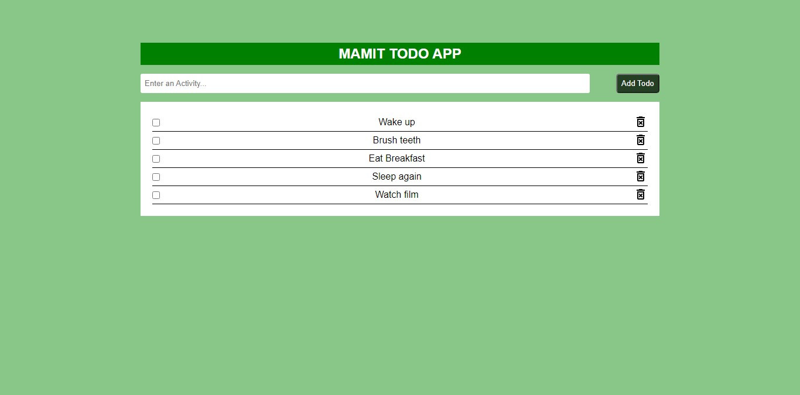

# MAMIT TODO APP

### The challenge

-Be able to add items using the input field and add button
-Be able to delete any of the todo items by clicking on the respective delete icon
-On clicking on the todo list, it shouldmark the checkbox

### Screenshot

My knowledge of Javascript is minimal so forgive any mistakes in there 😃

